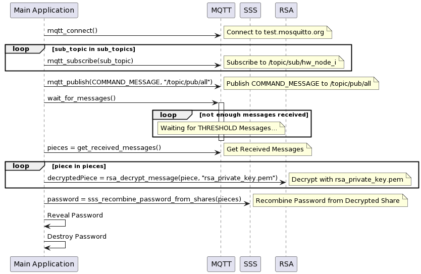
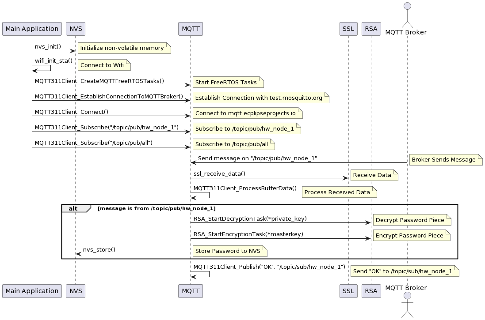
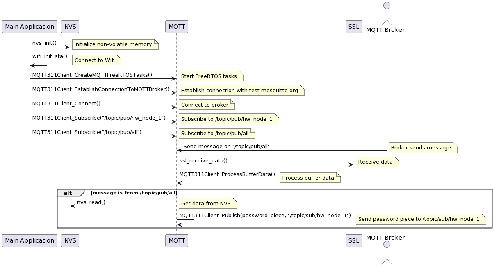

# The Design

This section showcases the design model that the software node and hardware nodes follow. Representing the design model of the system means describing a set of procedures it performs in order to successfully complete an operation. Since the two main operations present in both the software node and the hardware nodes are the password storage operation and password recovery operation, this section will focus on encapsulating the design model of the main application for both types of nodes. This means that the design flow will be seen from the perspective of the main application and the surrounding components will come into play once their functionality is needed upon in the execution of the operation.

To simplify the explanations and the corresponding diagrams, there will be no distinction made between the component layer and the library layer and the outside factors (not present in the main application) will be denoted by their functionality type. This would mean, for example, that both the MQTT 3.1.1 client library from the library layer and the MQTT component from the component layer represent the same entity providing MQTT functionality.

## Software Node

As was stated in several places throughout this thesis, the software node performs two processes - the password storage process and the password recovery process. Since these two processes have been explained thoroughly through the analysis of their key components in various sections of this thesis, the following two figures serve the purpose of providing a clear representation of the design model through the practical real-world use of this system.

### Password Storage Process

The figure below represents the sequence diagram of the password storage process as seen from the perspective of the software node.

### Password Recovery Process

The figure below represents the sequence diagram of the password recovery process as seen from the perspective of the software node.

## Hardware Nodes

Exactly the same as in the software node case, the hardware nodes perform two of the same processes as well. Since the hardware nodes operate under the conditions of the operating system FreeRTOS, it is more difficult to represent their design flow but the best attempt was made with the use of the following two sequence diagrams.

### Password Storage Process

The figure below represents the sequence diagram of the password storage process as seen from the perspective of the hardware node.

### Password Recovery Operation

The figure below represents the sequence diagram of the password recovery process as seen from the perspective of the hardware node.

