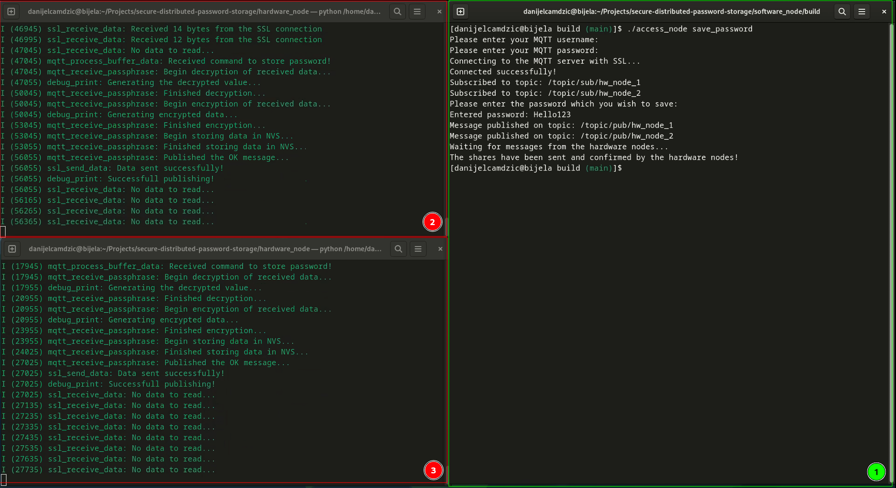
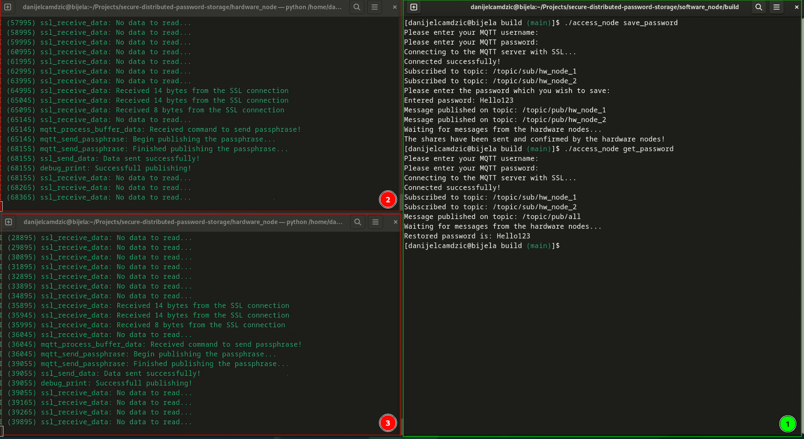
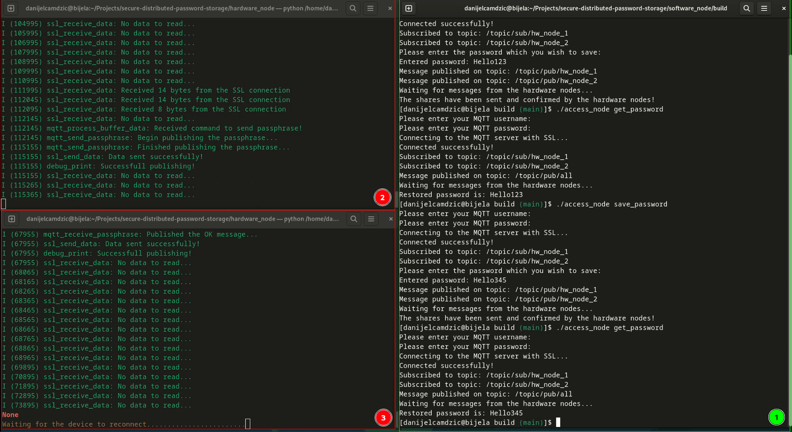

# Results

In order to observe how the system works and behaves under different scenarios, a real-world case described in the previous chapter was utilized. The software node is run on a laptop running GNU/Linux operating system and the two hardware nodes which comprise the system are the ESP32 devices.

In the figures below, terminal window 1 represents the software node and terminal windows 2 and 3 represent the ESP32 devices.

The figure below represents a screenshot of a laptop screen where the software node application was run. It demonstrates the password storage process.

From the debug information present in the terminal windows it can be followed how the nodes completed their tasks. The software node sent the password pieces, which got stored in the non-volatile memory of the ESP32 devices which consequently sent confirmation messages back to the software node, effectively ending the process.

The figure below also represents a screenshot of the laptop screen but with a password recovery process in display.

From the debug information, it can be observed that when the software node sends a command to recover the password, the ESP32 devices receive it, respond by sending the password pieces back and the software node reconstructs the original password.

The figure below represents a screenshot of a laptop screen depicting a scenario in which one of the hardware nodes goes offline.

From the debug information, it is seen that ESP32 device on the terminal window 3 went offline and is unable to respond to the password recovery request. The password piece is only sent by the ESP32 device from the terminal window 2 but the original password is still correctly reconstructed as the threshold value in this system was set to 1.
