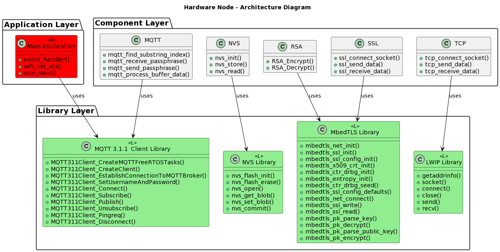

# System Architecture

This section presents the architectural model that the software node and hardware nodes use. It includes detailed descriptions of the components that comprise the node's interior structure as well as the libraries that are utilized by those components and the main application as well. As this entire chapter is dedicated to the demonstration of the system based on a practical real-world use case scenario, all the details regarding the components and the choices that have been made are laid out as they are in this repository.

## Software Node

The software node is an application written in C++ programming language. It was developed and intended to be run on a device that supports the C++ build system - a laptop as it was used in this implementation, or some other device with similar capabilities. It consists of the main application, components that facilitate the main code, and the libraries that are employed by the components and the main application.

The software node does not feature an operating system as it is intended to be used for specific purposes for a limited duration of time after which it is exited. It consists of three layers:

* **Application Layer:** This layer features the main application which includes the main function and other helper functions which facilitate the main code.
	
* **Component Layer:** This layer features the components which are used by the main code to run the system.
	
* **Library Layer:** This layer features the libraries used by the components in the component layer to facilitate the execution of specific software tasks.

The application layer features the main application which contains two functions - a function to create a password and a function to run the main code. The main code is where all the action is happening based on the arguments with which the software node program is called. It either runs the password storage process or the password recovery process. The function which creates a password allows the user to choose a password while providing a secure way to do so by utilizing the termios [^1] library.

The component layer features different components whose purpose has been the thorough discussion of the preceding chapters. These components include:

1. **MQTT Component:** Provides a set of MQTT related functions.
	
2. **RSA Component:** Provides a set of functions connected to the RSA Encryption method.
	
3. **SSS Component:** Provides a set of functions connected to the Shamir's Secret Sharing Scheme.

The library layer features a set of software libraries that are used by the components from the component layer and which provide a set of APIs to the methods abstracted to the main application by the component layer. These libraries are:

1. **Paho MQTT Library:** This library provides MQTT features to the device. It gives it an ability to be an MQTT client and exchange messages over the MQTT protocol.
	
2. **OpenSSL Library:** This library includes many cryptograhic methods among which are the RSA key generation, the RSA encryption and the RSA decryption.
	
3. **SSS Library:** This library implements the Shamir's Secret Sharing Scheme and provides an API for the functions which split up the password and reassemble the password shares.

The figure below provides a graphical representation of the architectural model that the software node uses. It clearly depicts the architectural layers described, the components utilized by the main application, and the libraries used by the components.

## Hardware Nodes

Hardware nodes represent a cluster of small resource-constrained embedded devices with internet access. In contrast to the software node, the hardware nodes are meant to be network-connected all the time (although occasional disconnections are not a problem if they are not occurring due to the fault of the device). This is because they are supposed to listen and wait for commands telling them to send their password shares back in order for the user to recover the password.

In this practical implementation, a cluster of ESP32 devices was chosen to play the role of hardware nodes. The choice was made due to a number of reasons which include cost-effectiveness (as ESP32 devices are really cheap), low-power consumption, ease of programming (supports multiple programming languages) and built in WiFi connectivity support (which reduces the hassle to have devices be network connected all the time) among many others.

The ESP32 devices, that are our hardware nodes, feature an operating system, a FreeRTOS library, mainly due to the incorporation of the MQTT 3.1.1 client library which utilizes FreeRTOS from the get-go.

The hardware nodes' architectural model is comprised of the same three layers as in the software node's case. It features an application layer, a component layer, and a library layer with the same principles in mind.

The application layer features the main application which in the case of the hardware nodes contains the main code function and a WiFi initialization function. ESP32 provides a convenient way to connect to the WiFi with the utilization of the esp_wifi library which comes with the ESP32 software development tools. The main code serves to start the WiFi connection process, establish a connection between the device and the chosen MQTT broker, subscribe to relevant topics, and initialize the non-volatile memory of the device. For the MQTT-related procedures, it uses the MQTT 3.1.1 client library which was the topic of discussion in chapter 4 and for the non-volatile memory procedures, it uses the NVS component from the component layer.

The component layer features a number of components with various purposes. These components are:

1. **MQTT Component:** Provides a set of MQTT related functions.
2. **RSA Component:** Provides a set of functions related to the RSA Encryption method.
3. **NVS Component:** Provides a set of functions related to the handling of the non-volatile memory of the ESP32 device.
4. **SSL Component:** Provides a set of functions for opening an SSL socket as well as sending and reading data through it.
5. **TCP Component:** Provides a set of functions for opening an TCP socket as well as sending and reading data through it.

The library layer features a number of software libraries for the ESP32 devices which, for the purposes of this real-world use case, are:

1. **MQTT 3.1.1 Client Library:** This library provides MQTT 3.1.1 features to small embedded devices with low-power consumption and turns them into MQTT 3.1.1 client devices.
2. **NVS Library:** This library includes API for working with the non-volatile memory of the ESP32 device.
3. **MbedTLS Library:** This library includes cryptographic methods used by the ESP32 device, including SSL socket functionality (for the encryption layer on top of TCP) as well as RSA Encryption method functionality.
4. **LWIP Library:** This library includes API for working with TCP sockets.

The figure below provides a graphical representation of the architectural model that the hardware node uses. It clearly depicts the architectural layers described, components utilized by the main application and library used by the components.

